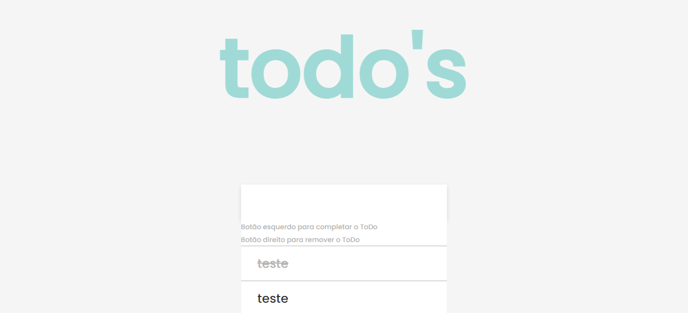

### Todo's Javascript
Organizador de tarefas feito em Javascript puro, podendo marcar as tarefas como concluídas, assim como excluí-las.



Para clonar este repositório:
```
  $ git clone https://github.com/enzovga/todosjs.git 
```

Para testar o programa recomendo utilizar a extensão "Live Server", disponível no VSCode.
